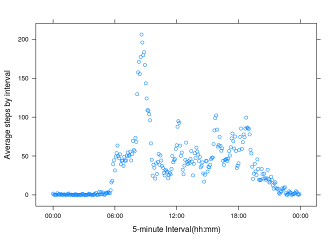
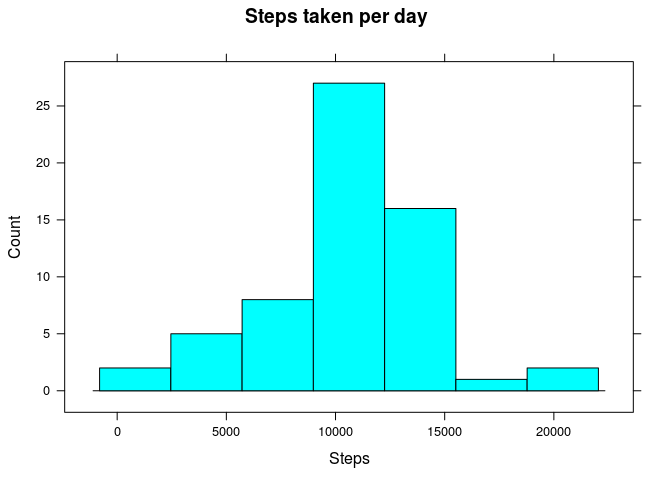

# Reproducible Research: Peer Assessment 1

## Loading and preprocessing the data

```r
require(dplyr,quietly=TRUE)
```

```
## 
## Attaching package: 'dplyr'
## 
## The following objects are masked from 'package:stats':
## 
##     filter, lag
## 
## The following objects are masked from 'package:base':
## 
##     intersect, setdiff, setequal, union
```

```r
require(lattice,quietly=TRUE)
require(stringr,quietly=TRUE)
data.activity <- read.csv("activity.csv")
daily.steps <- data.activity %>% group_by(date) %>%  summarise_each(funs(sum))
activity.clean = data.activity[complete.cases(data.activity),]
```

## What is mean total number of steps taken per day?

```r
histogram(~steps,data=daily.steps,type="count",
       xlab="Steps",
       main="Steps taken per day")
```

 

The mean of the total number of steps taken per day is:

```r
mean(daily.steps$steps, na.rm = TRUE)
```

```
## [1] 10766.19
```

The median total number of steps taken per day is:

```r
median(daily.steps$steps, na.rm = TRUE)
```

```
## [1] 10765
```

## What is the average daily activity pattern?

```r
daily.pattern <- activity.clean %>% group_by(interval) %>%  summarise_each(funs(mean))
daily.pattern <- daily.pattern[,c("interval","steps"),drop=FALSE]
daily.pattern<-transform(daily.pattern, interval = str_pad(as.character(interval),4,pad="0"))
daily.pattern.ts<-transform(daily.pattern, interval = as.POSIXct(strptime(interval, format="%H%M")))
xyplot(steps~interval,data=daily.pattern.ts, ylab="Average steps by interval", xlab="5-minute Interval(hh:mm)",scales = list(x = list(format = "%H:%M")))
```

 

The 5-minute interval, on average across all the days in the dataset, containing the maximum number of steps is:

```r
strftime(strptime((daily.pattern[which.max(daily.pattern$steps),]$interval),format = "%H%M"),"%H:%M")
```

```
## [1] "08:35"
```

## Imputing missing values

The number of missing values is: 

```r
nrow(data.activity[is.na(data.activity$steps),])
```

```
## [1] 2304
```

Create a new dataset that is equal to the original dataset but with the missing data filled in:


- The missing values are filled with the mean of that interval for the whole data.


```r
daily.pattern <- activity.clean %>% group_by(interval) %>%  summarise_each(funs(mean))
daily.pattern <- daily.pattern[,c("interval","steps"),drop=FALSE]
missing.filled <- merge(data.activity,daily.pattern, by="interval")
missing.filled <- missing.filled[order(missing.filled$date),]
missing.filled$steps.y<-round(missing.filled$steps.y)
missing.filled$steps.x[is.na(missing.filled$steps.x)] <- missing.filled$steps.y[is.na(missing.filled$steps.x)]
missing.filled <- missing.filled[,c("interval","steps.x","date"),drop=FALSE]
daily.steps <- missing.filled %>% group_by(date) %>%  summarise_each(funs(sum))
histogram(~steps.x,data=daily.steps,type="count",
       xlab="Steps",
       main="Steps taken per day")
```

 

The mean of the total number of steps taken per day is:

```r
mean(daily.steps$steps.x)
```

```
## [1] 10765.64
```

The median total number of steps taken per day is:

```r
median(daily.steps$steps.x)
```

```
## [1] 10762
```

There isn't a significant impact when filling the dataset with the mean of that interval for the whole data.

## Are there differences in activity patterns between weekdays and weekends?
