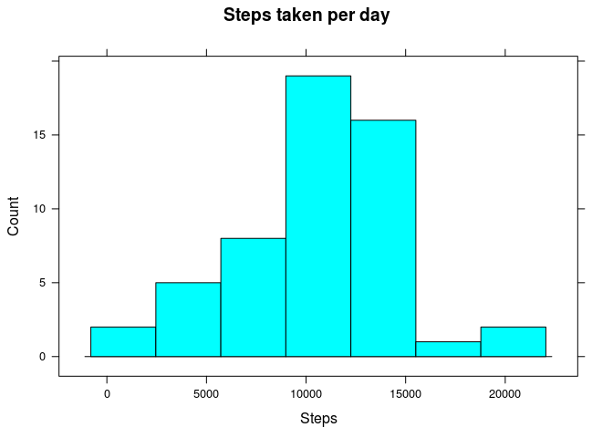

# Reproducible Research: Peer Assessment 1


## Loading and preprocessing the data


```r
data.activity <- read.csv("activity.csv")
```

## What is mean total number of steps taken per day?

```r
library(dplyr)
```

```
## 
## Attaching package: 'dplyr'
## 
## The following objects are masked from 'package:stats':
## 
##     filter, lag
## 
## The following objects are masked from 'package:base':
## 
##     intersect, setdiff, setequal, union
```

```r
require(lattice)
```

```
## Loading required package: lattice
```

```r
daily.steps <- data.activity %>% group_by(date) %>%  summarise_each(funs(sum))
nrow(daily.steps)
```

```
## [1] 61
```

```r
head(daily.steps)
```

```
## Source: local data frame [6 x 3]
## 
##         date steps interval
## 1 2012-10-01    NA   339120
## 2 2012-10-02   126   339120
## 3 2012-10-03 11352   339120
## 4 2012-10-04 12116   339120
## 5 2012-10-05 13294   339120
## 6 2012-10-06 15420   339120
```

```r
histogram(~date,data=daily.steps,type="count",
       xlab="Days",
       main="Steps taken per day")
```

 

## What is the average daily activity pattern?


## Imputing missing values


## Are there differences in activity patterns between weekdays and weekends?
